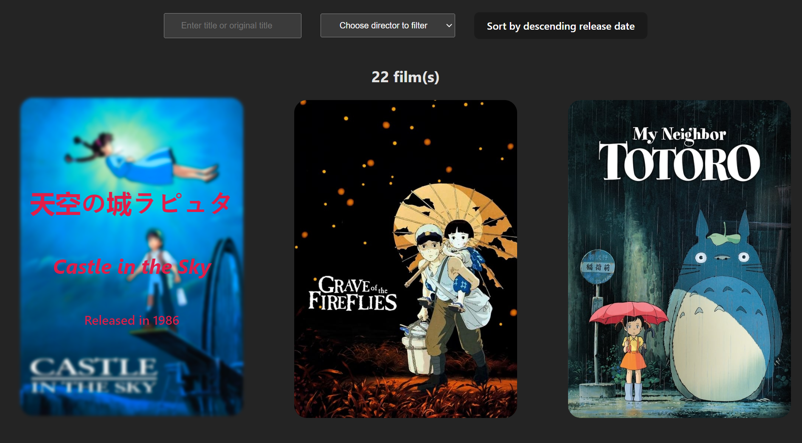

# Ghibli-Studio-React
This application allows you to view the various animated films produced by Ghibli Studio.  
This application is available, click on this [LINK](https://ryukshi.github.io/Ghibli-Studio-React/ "Ghibli Studio React") to discover it.

## Home screenshot

That's home page screenshot



## Recommended IDE Setup

[VSCode](https://code.visualstudio.com/) + [Volar](https://marketplace.visualstudio.com/items?itemName=Vue.volar) (and disable Vetur) + [TypeScript Vue Plugin (Volar)](https://marketplace.visualstudio.com/items?itemName=Vue.vscode-typescript-vue-plugin).

## Customize configuration

See [Vite Configuration Reference](https://vitejs.dev/config/).

## Project Setup

### Install Dependencies

```sh
npm i
```

### Compile and Hot-Reload for Development

```sh
npm run dev
```

### Compile and Minify for Production

```sh
npm run build
```

### Locally preview production build

```sh
npm run preview
```
